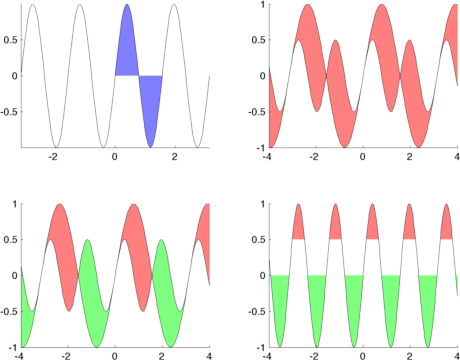

# fill_between.m

A Matlab function to fill selected areas in plots. This function was inspired by a function with the same name in the Python library, Matplotlib. 

The function has the following arguments:

    [y1handle, y2handle, h] = fill_between(x,y1,y2, where, opts);

* `x` is a vector of x locations
* `y1` and `y2` are vectors of y locations
* `where` is any binary vector specifying the conditions under which the regions between `y1` and `y2` will be filled. This is a nice property as we can plot a curve, and decide to only fill a particular region of that curve (see top left in figure below).
	* if `where=1` or `where=[]` then we assume we want to fill all of the x values given (see the top right example).
	* `y1` and `y2` can both be vectors, in which case we will fill between then (see top right, and bottom left examples).
	* `y1` or `y2` (but not both) can be constants, and we just fill up to a particular y baseline see bottom right example.
* `opts` is a cell array of patch properties which will be applied to the fill.

Functionality is demonstrated with the file `demo_plot.m`

But here is a snippet for the top left example:

    x = linspace(-pi,pi,200);
    y = sin(x*4);
    
    fill_between(x, y, 0, x>0 & x<pi/2, 'EdgeColor', 'none', 'FaceColor', [0.5 0.5 1]);

If you'd like to improve the functionality, please do feel free to create a branch and submit a pull request.